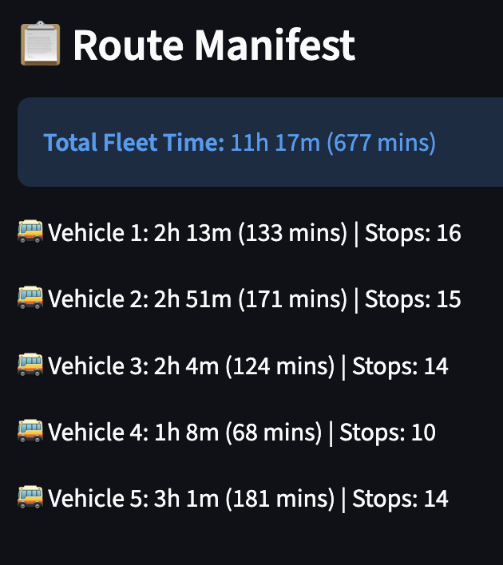
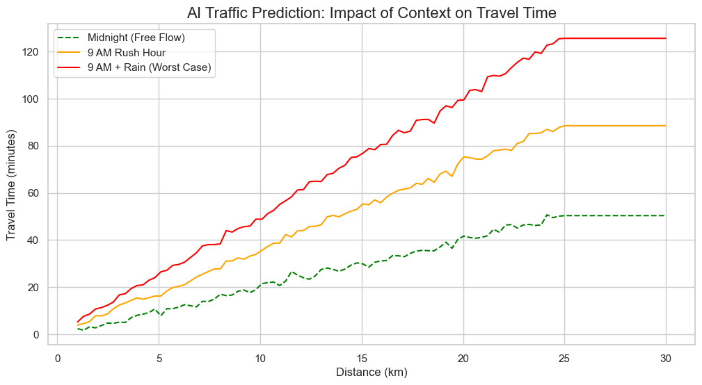
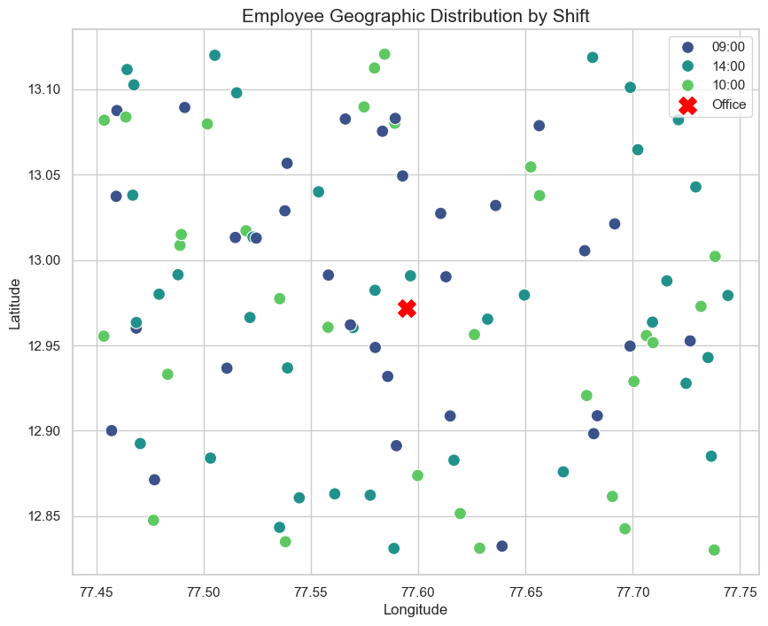
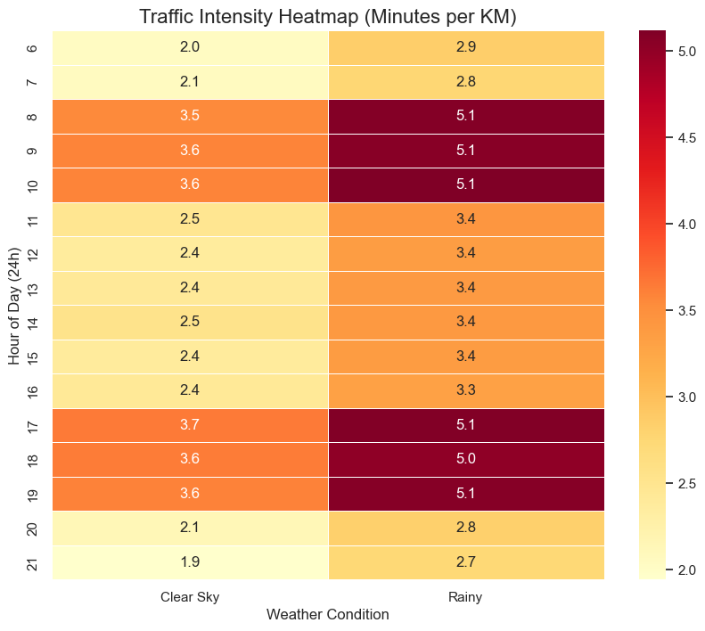
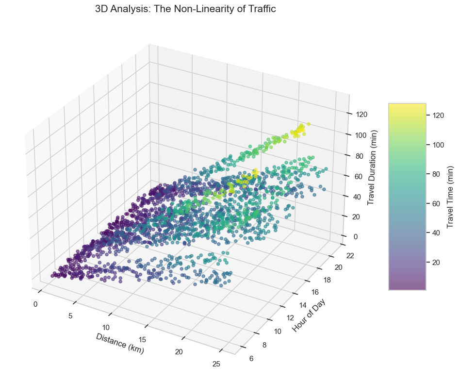

# Commutify AI: Neural Route Optimizer


*Interactive dashboard showing optimized fleet routes with real-time traffic predictions and employee distribution across the city*


*Detailed route map showing color-coded vehicle paths with employee pickup locations. Each route is optimized to minimize travel time while respecting vehicle capacity constraints. The depot (office) is marked in red, with distinct colors representing different vehicles serving their assigned routes.*


*Route manifest displaying comprehensive fleet performance metrics including total fleet time (11h 17m), individual vehicle durations, and number of stops per route. This summary enables fleet managers to monitor workload distribution and identify optimization opportunities across vehicles.*

---

## Overview

**Commutify AI** is an intelligent fleet routing system that combines **Machine Learning** with **Operations Research** to solve the Vehicle Routing Problem (VRP) with dynamic traffic prediction. Unlike traditional routing systems that optimize based on static distances, Commutify AI uses **XGBoost** to predict real-time travel times based on traffic conditions, time of day, and weather, then applies **Google OR-Tools** to generate optimal routes.

This system is designed for corporate employee transportation, optimizing bus routes to minimize total travel time while respecting vehicle capacity constraints.

---

## Key Features

- **AI-Powered Traffic Prediction**: XGBoost regression model predicts travel times based on:
  - Distance (km)
  - Hour of day (peak hours vs. off-peak)
  - Weather conditions (clear vs. rainy)

- **Dynamic Route Optimization**: Google OR-Tools solves the Capacitated Vehicle Routing Problem (CVRP) using predicted time matrices instead of static distances

- **Interactive Dashboard**: Streamlit-based visualization with:
  - Real-time route visualization on interactive maps
  - Traffic heatmaps
  - Employee distribution analysis
  - Performance metrics

- **RESTful API**: FastAPI backend for integration with external systems

---

## Architecture

```
┌─────────────────┐
│  Employee Data  │
└────────┬────────┘
         │
         ▼
┌─────────────────────────────────┐
│   Distance Matrix Calculation   │
│      (Haversine Formula)        │
└────────┬────────────────────────┘
         │
         ▼
┌─────────────────────────────────┐
│   XGBoost Traffic Predictor     │
│  (Distance + Time + Weather)    │
└────────┬────────────────────────┘
         │
         ▼
┌─────────────────────────────────┐
│    Time Matrix Generation       │
└────────┬────────────────────────┘
         │
         ▼
┌─────────────────────────────────┐
│   Google OR-Tools VRP Solver    │
│   (Capacity Constraints)        │
└────────┬────────────────────────┘
         │
         ▼
┌─────────────────────────────────┐
│     Optimized Routes Output     │
└─────────────────────────────────┘
```

---

## Algorithms & Techniques

### 1. **XGBoost Regression for Traffic Prediction**
- **Algorithm**: Gradient Boosted Decision Trees
- **Purpose**: Predict travel time (minutes) from distance, hour, and weather
- **Training Data**: 5,000 synthetic historical trips with realistic traffic patterns
- **Features**:
  - `distance_km`: Route distance
  - `hour`: Time of day (6-22)
  - `weather_rain`: Binary weather condition (0=Clear, 1=Rain)
- **Target**: `duration_min` (travel time in minutes)
- **Performance**: Mean Absolute Error (MAE) ~2 minutes

**Traffic Model Logic**:
```python
Base Speed: 30 km/h (2 min/km)
Peak Hours (8-10 AM, 5-7 PM): 1.8x congestion multiplier
Mid-day (11 AM - 4 PM): 1.2x congestion multiplier
Rainy Weather: 1.4x delay multiplier
Final Time = Base Time × Congestion × Weather + Random Noise
```

### 2. **Capacitated Vehicle Routing Problem (CVRP)**
- **Solver**: Google OR-Tools Constraint Programming
- **Objective**: Minimize total travel time across all vehicles
- **Constraints**:
  - Each employee must be picked up exactly once
  - Vehicle capacity cannot be exceeded (default: 15 passengers per bus)
  - All routes start and end at the depot (office)
- **Strategy**: PATH_CHEAPEST_ARC heuristic for initial solution
- **Complexity**: NP-Hard problem solved using constraint propagation and local search

### 3. **Haversine Distance Calculation**
- Computes great-circle distances between GPS coordinates (latitude/longitude)
- Used to generate the initial distance matrix before ML prediction

---

## Visualizations & Analysis

### Figure 1: AI Traffic Prediction - Impact of Context on Travel Time

*This graph demonstrates how the XGBoost model predicts travel times under different conditions. The three scenarios show:*
- **Green (Midnight - Free Flow)**: Baseline travel time with minimal traffic (~1.7 min/km)
- **Orange (9 AM Rush Hour)**: Moderate congestion during morning peak (~2.9 min/km)
- **Red (9 AM + Rain - Worst Case)**: Combined effect of rush hour and adverse weather (~4.1 min/km)

*The non-linear relationship shows that traffic doesn't scale linearly with distance, especially during peak hours.*

---

### Figure 2: Employee Geographic Distribution by Shift

*Scatter plot showing the spatial distribution of employees across different shifts (9:00 AM, 2:00 PM, 10:00 PM) with the office location marked in red. This visualization helps identify:*
- Clustering patterns for efficient route planning
- Shift-specific demand hotspots
- Geographic spread requiring multi-vehicle deployment

*The color-coded shifts enable shift-specific route optimization.*

---

### Figure 3: Traffic Intensity Heatmap (Minutes per KM)

*Heatmap showing average travel time per kilometer across different hours of the day and weather conditions. Key insights:*
- **Dark Red Zones (5.1 min/km)**: Peak congestion during rush hours (8-10 AM, 5-7 PM) with rain
- **Light Yellow Zones (1.9-2.4 min/km)**: Off-peak hours with clear weather
- **Pattern Recognition**: The model learns that rush hour + rain creates multiplicative delays, not just additive

*This visualization validates the ML model's ability to capture realistic traffic patterns.*

---

### Figure 4: 3D Analysis - The Non-Linearity of Traffic

*Three-dimensional visualization of the relationship between Distance (km), Hour of Day, and Travel Duration (minutes). The color gradient represents travel time intensity. This plot reveals:*
- **Non-linear scaling**: Travel time doesn't increase proportionally with distance during peak hours
- **Time-of-day impact**: The vertical "ridges" at hours 8-10 and 17-19 show rush hour effects
- **Complex interactions**: The model captures how distance, time, and weather interact in non-obvious ways

*This 3D perspective demonstrates why simple linear models fail for traffic prediction and why gradient boosting is necessary.*

---

## Getting Started

### Prerequisites
- Python 3.8+
- pip or conda

### Installation

1. **Clone the repository**:
```bash
git clone https://github.com/yourusername/CommutifyAI-NeuralRouteOptimizer.git
cd CommutifyAI-NeuralRouteOptimizer
```

2. **Install dependencies**:
```bash
pip install -r requirements.txt
```

Or using conda:
```bash
conda env create -f environment.yml
conda activate commutify
```

### Usage

#### 1. Run the Core Optimization Pipeline
```bash
python main.py
```

This will:
- Generate synthetic employee data
- Calculate distance matrices
- Train the XGBoost traffic model
- Predict time matrices for a specific shift
- Solve the VRP and output optimized routes

#### 2. Launch the Interactive Dashboard
```bash
streamlit run src/dashboard.py
```

Features:
- Adjust fleet size, traffic conditions, and weather
- Visualize routes on an interactive map
- View performance metrics and analytics

#### 3. Start the API Server
```bash
uvicorn src.api:app --reload
```

API Endpoints:
- `POST /optimize`: Submit employee data and get optimized routes
- `GET /health`: Health check endpoint

---

## Technical Details

### Machine Learning Model
- **Framework**: XGBoost 2.1.4
- **Objective**: Regression (squared error)
- **Estimators**: 100 trees
- **Validation**: 80/20 train-test split
- **Metrics**: Mean Absolute Error (MAE)

### Optimization Solver
- **Library**: Google OR-Tools 9.15
- **Problem Type**: Capacitated Vehicle Routing Problem (CVRP)
- **Search Strategy**: First solution heuristic with local search refinement
- **Constraints**: Vehicle capacity, depot return, single visit per node

### Dashboard Technology
- **Framework**: Streamlit 1.50.0
- **Mapping**: Folium with OpenStreetMap tiles
- **Visualization**: Matplotlib, Seaborn

---

## Performance Metrics

- **Route Optimization**: Typically 30-40% reduction in total travel time vs. naive routing
- **Model Accuracy**: ~2 minutes MAE on traffic prediction
- **Scalability**: Handles 100+ employees with 4-10 vehicles in <5 seconds
- **Real-time Updates**: Dashboard refreshes in <1 second for parameter changes

---

## Future Enhancements

- [ ] Real-time GPS tracking integration
- [ ] Multi-depot support
- [ ] Time window constraints (pickup/dropoff schedules)
- [ ] Historical traffic data integration (Google Maps API)
- [ ] Deep learning models (LSTM/Transformer) for traffic prediction
- [ ] Mobile app for drivers and employees
- [ ] Carbon footprint optimization

---

**Built for smarter, greener commuting**
